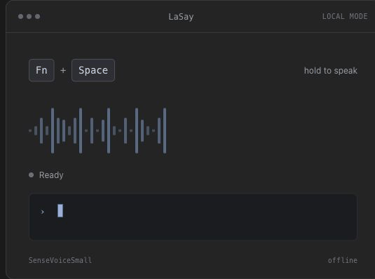

# LaSay

<p align="center"></p>

<p align="center">Voice input for developers on macOS.</p>

Hold a shortcut, speak naturally in English, Chinese, or both, then release. LaSay turns your speech into text, keeps technical terms such as `React` and `FastAPI` intact, and copies the result for use in any app.

<p align="center"></p>

[繁體中文](README_ZH.md) · [Download the latest DMG](https://github.com/tamio0800/LaSay/releases/latest)

## Install

Paste this one command into Terminal. It adds LaSay's Homebrew source, then installs the app.

```bash
brew tap tamio0800/tap && brew install --cask lasay
```

Prefer a DMG? Download the app from [GitHub Releases](https://github.com/tamio0800/LaSay/releases/latest), then drag LaSay to Applications.

To update a Homebrew installation:

```bash
brew upgrade --cask lasay
```

## Use it

1. Open **LaSay** from Applications and allow Microphone access.
2. Hold **Fn + Space** anywhere you can type. You can choose Control + Space or Option + Space in Settings.
3. Speak, then release the shortcut. LaSay copies the result; paste it with **Command + V**.

Accessibility permission is optional. Enable it in LaSay Settings only if you want LaSay to paste automatically at the cursor.

## Choose where transcription happens

| Mode | What happens | API key | Cost |
| --- | --- | --- | --- |
| **Local (default)** | The included SenseVoiceSmall model processes recorded audio on your Mac. | Not needed | Free |
| **OpenAI cloud** | LaSay sends the recording to OpenAI for transcription. | Required | Depends on your selected model |

LaSay does not require a LaSay account or sync your content. Your OpenAI API key is stored in macOS Keychain. If you enable optional OpenAI text cleanup, the transcribed text is also sent to OpenAI.

## What you get

- Push-to-talk voice input in VS Code, Terminal, Slack, browsers, and other text fields
- English, Traditional Chinese, Japanese, Korean, and automatic language detection
- Built-in technical-term corrections for framework names, code identifiers, and common abbreviations
- Optional OpenAI transcription, text cleanup, and custom model IDs
- A simple menu-bar app with launch-at-login and configurable shortcuts

## Requirements

- Apple silicon Mac
- macOS 13.5 (Ventura) or later
- Internet connection and an OpenAI API key only for OpenAI features

## Build from source

```bash
git clone https://github.com/tamio0800/LaSay.git
cd LaSay
open LaSay/LaSay.xcodeproj
```

Choose your Apple Development signing team in Xcode, then build with **Command + B**. Xcode resolves the included dependencies automatically.

## License

LaSay's original source code is available under the [MIT License](LICENSE). The bundled model and native runtime retain their own licenses; see [Third-Party Notices](THIRD_PARTY_NOTICES.md).
