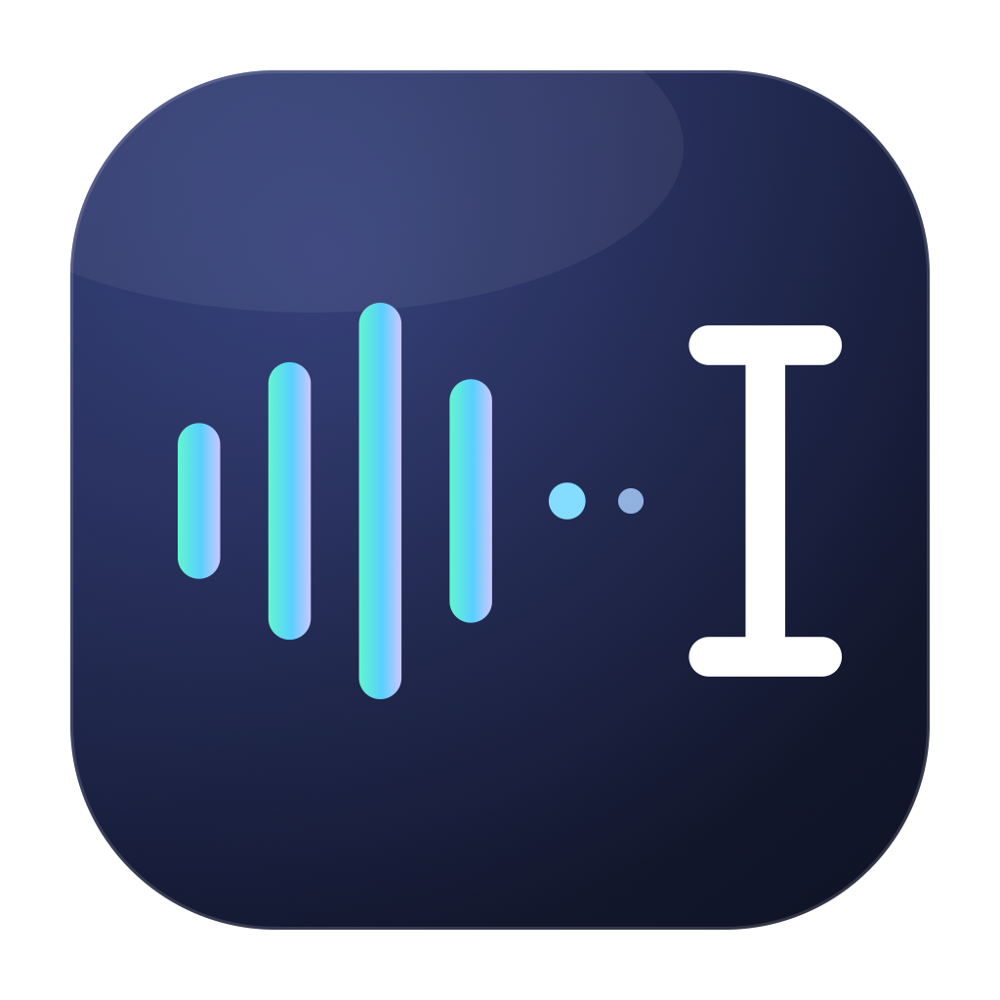
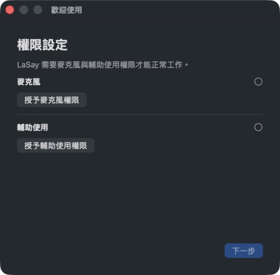

# LaSay

Voice input for developers. Dictate in your native language with English technical terms -- LaSay keeps them intact.

[繁體中文說明](README_ZH.md)

<p align="center"></p>

[](https://github.com/tamio0800/LaSay/actions/workflows/ci.yml)


## Why LaSay

Developers think in mixed languages. You say "help me refactor the useEffect hook" in Mandarin, and every transcription tool mangles "useEffect" into nonsense. LaSay solves this with a 300+ term technical dictionary and AI post-processing that preserves code identifiers, framework names, and technical jargon exactly as spoken.

**Hold Fn+Space. Speak. Release. Text appears at your cursor.**

Works in any app -- VS Code, Terminal, Slack, browser, anywhere you type.

## Features

- **Mixed-language transcription** -- speak your native language with English technical terms
- **300+ technical terms preserved** -- React, FastAPI, Kubernetes, camelCase identifiers, all kept intact
- **Two transcription modes** -- Cloud (OpenAI Whisper API) or Local (SenseVoice, fully offline)
- **AI text cleanup** -- removes filler words, fixes grammar, preserves technical terms (GPT-5-mini)
- **Global hotkey** -- Fn+Space works in any application
- **Instant paste** -- text appears at your cursor the moment transcription completes
- **Secure storage** -- API keys stored in macOS Keychain

## Quick Start

> A signed public download is not available yet. Build from source using the instructions below.

```
1. Install LaSay.app to /Applications
2. Grant Microphone + Accessibility permissions on first launch
3. Menu bar → Settings → enter your OpenAI API Key
4. Hold Fn+Space anywhere to dictate
```

No account. No signup. No cloud sync. Your API key, your data.



## Architecture

```
Fn+Space (hold)
    │
    ▼
AudioRecorder (16kHz mono AAC)
    │
    ├─► Cloud: OpenAI Whisper API ──► transcription
    │
    └─► Local: SenseVoice ──────────► transcription
                                          │
                                          ▼
                                   TechTermsDictionary
                                   (300+ regex corrections)
                                          │
                                          ▼
                                   AI Polish (optional)
                                   GPT-5-mini text cleanup
                                          │
                                          ▼
                                   Auto-paste at cursor
```

## Transcription Modes

| Mode | Engine | Latency | Cost | Offline |
|------|--------|---------|------|---------|
| Cloud | OpenAI Whisper API | ~1-2s | ~$0.001/use | No |
| Local | SenseVoiceSmall (int8) | ~2-4s | Free | Yes |

The SenseVoiceSmall model is bundled with the app, so local mode requires no download.

## Configuration

### Permissions

LaSay requires two macOS permissions:

- **Microphone** -- System Settings > Privacy & Security > Microphone
- **Accessibility** -- System Settings > Privacy & Security > Accessibility (for global hotkey)

Grant both once in onboarding. LaSay activates the hotkey immediately; no restart is required.

### Settings

Access via menu bar icon > Settings:

- **Transcription mode** -- Cloud or Local
- **Transcription language** -- Auto / Chinese / English / Japanese / Korean
- **AI text cleanup** -- toggle on/off, custom prompt supported
- **API Key** -- required for Cloud mode and AI cleanup

### API Key

Required for Cloud mode and AI text cleanup. Get one at [platform.openai.com/api-keys](https://platform.openai.com/api-keys).

Stored in macOS Keychain (not UserDefaults, not plaintext).

## Cost

Using Cloud mode with AI cleanup enabled:

| Component | Cost per use |
|-----------|-------------|
| Whisper API | ~$0.001 |
| GPT-5-mini (if enabled) | ~$0.00004 |
| **Total** | **~$0.001** |

100 uses per day = ~$3/month. Local mode is free.

## Supported Languages

Transcription: Auto-detect, Chinese (zh), English (en), Japanese (ja), Korean (ko)

UI: Traditional Chinese, English

## FAQ

**Hotkey not working?**
Open LaSay and follow the permission setup. The hotkey activates as soon as Accessibility access is granted.

**Works in Terminal?**
Yes, via simulated Cmd+V paste. Some terminal emulators may require additional configuration.

**How accurate is the technical term preservation?**
The dictionary covers 300+ terms across major languages (Python, JavaScript, TypeScript, Swift, Rust, Java, C/C++/C#), frameworks (React, FastAPI, Django, Spring), databases (PostgreSQL, MongoDB, Redis), DevOps tools (Docker, Kubernetes, Terraform), and common abbreviations (API, SDK, CI/CD, ORM).

**Can I use it without an API key?**
Yes. Switch to Local mode -- SenseVoice runs entirely on your machine. AI text cleanup requires an API key.

**Where is my API key stored?**
In macOS Keychain via the Security framework. Not in UserDefaults, not in plaintext files.

## System Requirements

- macOS 13.5 (Ventura) or later
- Apple Silicon Mac
- Internet connection (Cloud mode only)
- OpenAI API key (Cloud mode and AI cleanup)

## Build from Source

```bash
git clone https://github.com/tamio0800/LaSay.git
cd LaSay/LaSay
open LaSay.xcodeproj
# Xcode → Product → Build (Cmd+B)
```

Use an Apple Development signing team in Xcode. Ad-hoc signing changes the app's identity after rebuilds and causes macOS privacy permissions to reset. No CocoaPods or SPM setup is required; the pinned native runtime and model are bundled.

## License

LaSay's original source code is available under the [MIT License](LICENSE).
The bundled SenseVoiceSmall model and native runtime retain their own licenses;
see [Third-Party Notices](THIRD_PARTY_NOTICES.md).

---

Built by [Tamio Tsiu](mailto:tamio.tsiu@gmail.com)
