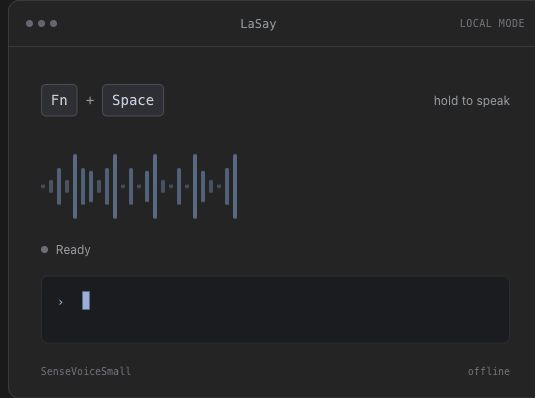

# LaSay

<p align="center"></p>

<p align="center">給開發者的 macOS 語音輸入工具。</p>

按住快捷鍵，用中文、英文或中英混合自然說話，再放開。LaSay 會將語音轉成文字、保留 `React`、`FastAPI` 等技術術語，並複製結果，讓你貼到任何 App。

<p align="center"></p>

[English](README.md) · [下載最新版 DMG](https://github.com/tamio0800/LaSay/releases/latest)

## 安裝

把這行指令貼到「終端機」。它會加入 LaSay 的 Homebrew 軟體來源，並安裝 App。

```bash
brew tap tamio0800/tap && brew install --cask lasay
```

不使用 Homebrew？從 [GitHub Releases](https://github.com/tamio0800/LaSay/releases/latest) 下載 DMG，再把 LaSay 拖到「應用程式」。

已透過 Homebrew 安裝時，使用這行更新：

```bash
brew upgrade --cask lasay
```

## 使用方式

1. 從「應用程式」開啟 **LaSay**，並允許麥克風權限。
2. 在任何可輸入文字的地方按住 **Fn + Space**。可在設定改為 Control + Space 或 Option + Space。
3. 說話後放開快捷鍵。LaSay 會複製結果；按 **Command + V** 貼上。

「輔助使用」是選用權限。只有想讓 LaSay 直接貼到游標位置時，才需要在 LaSay 設定中開啟它。

## 選擇辨識位置

| 模式 | 會發生什麼事 | API Key | 費用 |
| --- | --- | --- | --- |
| **本機（預設）** | 內建的 SenseVoiceSmall 模型在你的 Mac 處理錄音。 | 不需要 | 免費 |
| **OpenAI 雲端** | LaSay 會把錄音傳送到 OpenAI 進行辨識。 | 需要 | 取決於你選的模型 |

LaSay 不需要 LaSay 帳號，也不會同步你的內容。OpenAI API Key 會儲存在 macOS Keychain。若開啟選用的 OpenAI 文字整理，辨識後的文字也會傳送到 OpenAI。

## 你會得到什麼

- 在 VS Code、Terminal、Slack、瀏覽器與其他文字欄位按住說話
- 英文、繁體中文、日文、韓文，以及自動偵測語言
- 內建技術術語修正，協助保留框架名稱、程式碼識別字與常見縮寫
- 選用的 OpenAI 辨識、文字整理與自訂模型 ID
- 簡潔的選單列 App，支援登入後啟動與自訂快捷鍵

## 系統需求

- Apple Silicon Mac
- macOS 13.5（Ventura）或更新版本
- 只有 OpenAI 功能需要網路與 OpenAI API Key

## 從原始碼建置

```bash
git clone https://github.com/tamio0800/LaSay.git
cd LaSay
open LaSay/LaSay.xcodeproj
```

在 Xcode 選擇自己的 Apple Development signing team，接著按 **Command + B** 建置。Xcode 會自動處理專案包含的相依項目。

## 授權

LaSay 原始碼採 [MIT License](LICENSE)。內建模型與原生 runtime 各自適用其授權；完整聲明請見 [Third-Party Notices](THIRD_PARTY_NOTICES.md)。
